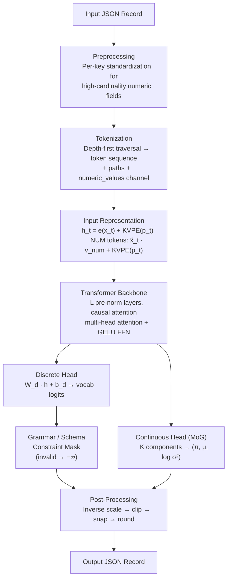

# Architecture

Origami is an autoregressive transformer-based model that operates on tokenized representations of JSON records. Unlike standard language models that process flat sequences, and unlike tabular methods that assume fixed columns, Origami understands the hierarchical structure of JSON through Key-Value Position Encoding (KVPE) and enforces valid output via grammar constraints.

This document describes each component in detail: preprocessing, tokenization, input representation, the transformer backbone, output heads, grammar and schema constraints, and post-processing. It is intended both as a reference for reimplementation and as context for understanding the codebase.

**Terminology.** We use *records* (analogous to rows) and *keys* (analogous to columns) when referring to JSON data. A *key path* is the dot-separated concatenation of nested keys through the record tree, with integer indices for array positions — for example, `user.addresses.0.city` refers to the `city` key of the first element in the `addresses` array under `user`.

## Preprocessing

**Source:** [origami/preprocessing/numeric_scaler.py](../origami/preprocessing/numeric_scaler.py)

Numeric keys in semi-structured data span a wide range of cardinalities. Low-cardinality keys (e.g., a `rating` key with integers 1–5) are treated as categorical tokens. For high-cardinality numeric keys — those with more than $\tau$ distinct values, where $\tau$ is a configurable threshold (`DataConfig.cat_threshold`, default 100) — we apply per-key standardization:

$$\tilde{x} = \frac{x - \mu_k}{\sigma_k}$$

where $\mu_k$ and $\sigma_k$ are the mean and standard deviation of numeric values under key $k$, estimated from training data. Scaled values are passed to the model through a dedicated continuous channel (see [Continuous Head](#continuous-head-mixture-of-gaussians)) and inverse-transformed during [post-processing](#post-processing).

## Tokenization

**Source:** [origami/tokenizer/json_tokenizer.py](../origami/tokenizer/json_tokenizer.py), [origami/tokenizer/vocabulary.py](../origami/tokenizer/vocabulary.py)

Each JSON record $d$ is serialized into a token sequence $\mathbf{x} = (x_1, \ldots, x_T)$ by a depth-first traversal. The vocabulary $\mathcal{V}$ consists of three disjoint token classes:

$$\mathcal{V} = \mathcal{V}_s \cup \mathcal{V}_k \cup \mathcal{V}_v$$

### Structural tokens ($\mathcal{V}_s$)

These delimit record boundaries, objects, arrays, and special markers:

| Token | ID | Purpose |
|-------|-----|---------|
| `PAD` | 0 | Padding for batched sequences |
| `START` | 1 | Beginning of a record |
| `END` | 2 | End of a record |
| `OBJ_START` | 3 | Opening `{` of an object |
| `OBJ_END` | 4 | Closing `}` of an object |
| `ARR_START` | 5 | Opening `[` of an array |
| `ARR_END` | 6 | Closing `]` of an array |
| `UNK_KEY` | 7 | Unknown key (not seen in training) |
| `UNK_VALUE` | 8 | Unknown value (not seen in training) |
| `NUM` | 9 | Placeholder for scaled continuous values |

### Key tokens ($\mathcal{V}_k$)

One token per distinct key observed in training. For example, if the training data contains objects with keys `"name"`, `"age"`, and `"city"`, the vocabulary includes `KEY("name")`, `KEY("age")`, and `KEY("city")`.

### Value tokens ($\mathcal{V}_v$)

One token per distinct categorical value — strings, booleans, `null`, and low-cardinality numbers.

### Tokenization example

```
Input:  {"name": "Alice", "age": 30}

Tokens: START  OBJ_START  KEY("name")  "Alice"  KEY("age")  30  OBJ_END  END
```

Nested objects and arrays are handled recursively: an object value emits `OBJ_START ... OBJ_END`, and an array emits `ARR_START ... ARR_END` with its elements in order.

### Continuous numeric channel

High-cardinality numeric values that were standardized in preprocessing emit the special `NUM` token in the discrete sequence. The scaled value $\tilde{x}$ is stored in a parallel continuous tensor (`numeric_values`) that travels alongside the token IDs through the model.

### Path tracking

Alongside each token $x_t$, the tokenizer records its key path $\mathbf{p}_t = (e_1, \ldots, e_{D_t})$ through the JSON hierarchy, where each element $e_i$ is either a key name or an array index, and $D_t$ is the nesting depth. For example, in `{"user": {"name": "Alice"}}`, the token for value `"Alice"` has path `(Key(user), Key(name))`.

Path elements are typed:
- **Type 0**: Padding (empty)
- **Type 1**: Key element
- **Type 2**: Array index element

These paths are used by KVPE (described below) to encode structural position.

## Input Representation

**Source:** [origami/model/embeddings.py](../origami/model/embeddings.py)

The input to the transformer at position $t$ is the sum of a token embedding and a position embedding:

$$\mathbf{h}_t^{(0)} = \mathbf{e}(x_t) + \text{KVPE}(\mathbf{p}_t)$$

where $\mathbf{e}: \mathcal{V} \to \mathbb{R}^d$ is a learned token embedding table.

### Key-Value Position Encoding (KVPE)

**Source:** [origami/position_encoding/kvpe.py](../origami/position_encoding/kvpe.py), [origami/position_encoding/pooling.py](../origami/position_encoding/pooling.py)

Standard transformers use sequential position indices (1, 2, 3, ...) or sinusoidal/rotary encodings. Since JSON key-value pairs have no inherent order, these positions would impose a spurious ordering on sibling keys. KVPE instead encodes each token's *structural position* — its path through the record tree.

Each path element is embedded independently:
- **Key elements** reuse the token embedding matrix $\mathbf{e}$ (tying key representations across the position and content channels, so the model recognizes `"name"` in position encoding as the same concept as the `KEY("name")` token).
- **Array index elements** use a separate embedding table $\mathbf{e}_{\text{idx}}: \{0, \ldots, I_{\max}\} \to \mathbb{R}^d$, where $I_{\max}$ is a configurable capacity (`ModelConfig.max_array_position`).

The sequence of element embeddings is aggregated into a single position vector. With the default **sum pooling**:

$$\text{KVPE}(\mathbf{p}_t) = \sum_{i=1}^{D_t} \mathbf{e}(e_i)$$

Five pooling strategies are available via `ModelConfig.kvpe_pooling`:

| Strategy | Aggregation | Properties |
|----------|-------------|------------|
| `sum` | $\sum_i \mathbf{e}(e_i)$ | Commutative — path element order doesn't matter. Simple and effective default. |
| `weighted` | $\sum_i w_i \cdot \mathbf{e}(e_i)$ with learnable depth weights $w_i$ | Commutative within depth, but different depths weighted differently. |
| `rotary` | Rotary position encoding applied per depth level | Injects depth-sensitive phase information. |
| `gru` | GRU processes $(e_1, \ldots, e_{D_t})$ sequentially | Non-commutative — path order matters. Distinguishes `a.b` from `b.a`. |
| `transformer` | Self-attention over path elements | Maximum expressiveness. Higher computational cost. |

### Numeric embedding

**Source:** [origami/model/embeddings.py:110-119](../origami/model/embeddings.py)

For positions where $x_t = \text{NUM}$, following [xVal (Golkar et al., 2023)](https://arxiv.org/abs/2310.02989), we replace the standard token embedding with a multiplicative embedding:

$$\mathbf{e}(x_t) = \tilde{x}_t \cdot \mathbf{v}_{\text{num}}$$

where $\mathbf{v}_{\text{num}} \in \mathbb{R}^d$ is a learned direction vector (initialized as $\mathcal{N}(0, 0.02)$) and $\tilde{x}_t$ is the standardized value. This injects continuous numeric information directly into the representation, encoding both the sign and magnitude of the standardized value as the direction and norm of the embedding vector.

## Transformer Backbone

**Source:** [origami/model/backbones/transformer.py](../origami/model/backbones/transformer.py)

The backbone is a stack of $L$ pre-norm decoder-only transformer layers with causal (autoregressive) attention:

$$\mathbf{z}_t^{(\ell)} = \mathbf{h}_t^{(\ell)} + \text{MHA}\bigl(\text{LN}(\mathbf{h}_t^{(\ell)})\bigr)$$

$$\mathbf{h}_t^{(\ell+1)} = \mathbf{z}_t^{(\ell)} + \text{FFN}\bigl(\text{LN}(\mathbf{z}_t^{(\ell)})\bigr)$$

where:
- $\text{MHA}$ is multi-head attention with $H$ heads and head dimension $d/H$
- $\text{FFN}$ is a two-layer feed-forward network with GELU activation and hidden dimension $d_{\text{ff}}$
- $\text{LN}$ denotes layer normalization (applied *before* attention and FFN — pre-norm style)

A final layer norm is applied after the last layer. Causal masking ensures each position attends only to itself and earlier positions.

### Left-padding

**Source:** [origami/training/collator.py](../origami/training/collator.py)

Since JSON records vary in length, batches are **left-padded** so that all sequences end at the same position:

```
Right-padding (standard):      Left-padding (Origami):
[START, a, 1, END, PAD, PAD]  [PAD, PAD, START, a, 1, END]  ← ends at pos 5
[START, a, 1, b, 2, END]      [START, a, 1, b, 2, END]      ← ends at pos 5
```

This allows `logits[:, -1, :]` to always be the representation of the last real token, simplifying batched next-token prediction. The attention mask uses `True` for real tokens and `False` for padding.

## Output Heads

**Source:** [origami/model/heads.py](../origami/model/heads.py)

The model has two output heads: a discrete head for structural, key, and categorical value tokens, and an optional continuous head for numeric values.

### Discrete head

A linear projection maps the final hidden state to vocabulary logits:

$$\ell_t = \mathbf{W}_d \, \mathbf{h}_t^{(L)} + \mathbf{b}_d \in \mathbb{R}^{|\mathcal{V}|}$$

Trained with cross-entropy loss over all non-padding positions.

### Continuous head (Mixture of Gaussians)

**Source:** [origami/model/heads.py:49-398](../origami/model/heads.py)

For high-cardinality numeric keys, the discrete head emits a `NUM` token while a parallel continuous head models the numeric value. The continuous head projects the hidden state to parameters of a Mixture of Gaussians (MoG) with $K$ components (`ModelConfig.num_mixture_components`, default 5):

$$(\boldsymbol{\pi}_t, \; \boldsymbol{\mu}_t, \; \log \boldsymbol{\sigma}_t^2) = \text{split}\bigl(\mathbf{W}_c \, \mathbf{h}_t^{(L)} + \mathbf{b}_c\bigr) \in \mathbb{R}^{3K}$$

where $\boldsymbol{\pi}_t = \text{softmax}(\cdot)$ are mixture weights. The numeric value $\tilde{x}_{t+1}$ is modeled as:

$$p(\tilde{x}_{t+1} \mid \mathbf{h}_t^{(L)}) = \sum_{j=1}^{K} \pi_{t,j} \; \mathcal{N}\bigl(\tilde{x}_{t+1}; \; \mu_{t,j}, \; \sigma_{t,j}^2\bigr)$$

**Loss for float positions:** Standard Gaussian MoG negative log-likelihood:

$$\mathcal{L}_{\text{NLL}} = -\frac{1}{N} \sum_{t \in \mathcal{S}_{\text{num}}} \log \sum_{j=1}^{K} \pi_{t,j} \; \mathcal{N}(\tilde{x}_{t+1}; \mu_{t,j}, \sigma_{t,j}^2)$$

**Loss for integer positions (e.g., array lengths):** Discretized logistic mixture NLL (PixelCNN++ style), which computes proper bin probabilities via sigmoid CDF differences with boundary absorption. This avoids the numerical instabilities of truncated Gaussian NLL at boundaries.

**Total training loss:**

$$\mathcal{L} = \mathcal{L}_{\text{CE}} + \lambda \, \mathcal{L}_{\text{NLL}}$$

where $\lambda$ is set proportionally to the fraction of `NUM` tokens relative to total tokens in each batch (auto-calculated by default, configurable via `ModelConfig.continuous_loss_weight`).

**Sampling:** At inference, the model samples from the MoG distribution. When truncation bounds are available (from schema constraints), inverse CDF sampling from the truncated distribution is used: components are reweighted by their mass within the bounds, then $u \sim \text{Uniform}(\text{CDF}(l), \text{CDF}(u))$ is mapped through the inverse CDF.

## Key-Order Shuffling

**Source:** [origami/training/dataset.py](../origami/training/dataset.py)

Since JSON object keys are unordered by specification, we randomly permute the key order at each nesting level every time a training example is accessed. Combined with KVPE (which encodes structural position rather than sequential position), this augmentation forces the model to attend to key semantics rather than memorizing a canonical ordering.

This mechanism serves as implicit regularization similar to Dropout: the model must learn to predict from varying contexts. Unlike Dropout, where a portion of the gradient information is discarded, key-order shuffling maintains full use of the training signal — only the ordering changes, not the information content.

Controlled by `TrainingConfig.shuffle_keys` (default `True`).

## Grammar Constraints

**Source:** [origami/constraints/json_grammar.py](../origami/constraints/json_grammar.py)

To guarantee syntactically valid JSON output, a pushdown automaton (PDA) tracks the grammatical state during both training and generation. The PDA maintains a stack encoding the current nesting context (object vs. array at each depth level) along with flags for parser state (e.g., whether a key is awaiting its value).

At each position $t$, the PDA computes a boolean mask $\mathbf{m}_t \in \{0, 1\}^{|\mathcal{V}|}$ indicating which tokens are grammatically valid as the next token. Invalid token logits are set to $-\infty$ before the softmax:

$$\hat{\ell}_{t,v} = \begin{cases} \ell_{t,v} & \text{if } m_{t,v} = 1 \\ -\infty & \text{otherwise} \end{cases}$$

### Training vs. inference

- **Training:** Grammar masks are computed in parallel across all positions. Since the PDA state updates involve many small sequential operations that incur synchronization overhead on GPU, mask computation is offloaded to CPU workers in the data loading pipeline (in the collator). While the GPU executes forward and backward passes on the current batch, DataLoader workers prepare grammar masks for subsequent batches in parallel.

- **Inference:** The PDA state is updated incrementally in $O(1)$ per step. The generator handles this in [origami/inference/generator.py](../origami/inference/generator.py).

## Schema Constraints

**Source:** [origami/constraints/json_grammar.py](../origami/constraints/json_grammar.py)

The grammar PDA enforces syntactic validity but says nothing about the *semantic* structure of the data — which keys may appear, what types each key admits, or which values are legal. Schema constraints address this by deriving a JSON Schema from the training data and compiling it into a mask that is intersected with the grammar mask.

### Schema derivation

Given a training corpus, the schema is automatically derived by analyzing:

- **Types:** Each key's observed Python types are mapped to JSON Schema types (`string`, `integer`, `number`, `boolean`, `null`, `object`, `array`).
- **Enumerations:** Keys with at most $\tau$ distinct primitive values receive an `enum` constraint listing all observed values.
- **Key restrictions:** Object schemas set `additionalProperties: false`, restricting keys to those observed in training. Keys present in every object are marked `required`.
- **Array bounds:** Observed array lengths yield `minItems` and `maxItems` constraints. Arrays where all observed instances contain unique elements are marked `uniqueItems`.
- **Numeric bounds:** Observed `minimum` and `maximum` values are recorded per numeric key.

### Compiled mask table

The schema is compiled into a mask table $\mathbf{M} \in \{0,1\}^{(P+1) \times |\mathcal{V}|}$, where $P$ is the number of unique key paths:

- **Row 0** is all-ones (default for positions outside the schema, such as record delimiters).
- **Each subsequent row** $i$ is a boolean mask reflecting the type, enum, and key restrictions for key path $i$.

Each token position maps to a key path via its KVPE path (with array indices replaced by a wildcard `*`). The schema mask for the full sequence is produced by a single gather operation. The effective constraint mask is:

$$\hat{\mathbf{m}}_t = \mathbf{m}_t \wedge \mathbf{s}_t$$

This design separates:
- **Path-dependent constraints** (type, enum, allowed keys) — pre-computed, applied via tensor gather at $O(1)$ per position.
- **Count-dependent constraints** (`minItems`, `maxItems`, `required`, `uniqueItems`) — require tracking state during generation, enforced incrementally at inference time only.

## Post-Processing

**Source:** [origami/preprocessing/postprocessor.py](../origami/preprocessing/postprocessor.py)

Numeric preprocessing introduces artifacts: standardized values decoded through the continuous head may not lie on the original scale's natural grid (e.g., integer keys produce floats, and sampled values may fall outside observed bounds). A deterministic post-processing pass corrects each generated value using the original-data schema (before preprocessing transforms):

1. **Clip to bounds:** Enforce the key's observed `minimum` and `maximum`.
2. **Snap to enum:** If the key has an `enum` constraint, replace the value with the nearest observed value (using $O(\log n)$ binary search).
3. **Round to integer:** If the key type is `integer` and no enum applies, round to the nearest integer.

This pipeline is applied recursively to nested objects and arrays. Post-processing is a lightweight operation that does not require model inference.

## Full Pipeline Summary



## Key Configuration Parameters

| Parameter | Config | Default | Description |
|-----------|--------|---------|-------------|
| `d_model` | `ModelConfig` | 128 | Hidden dimension $d$ |
| `n_heads` | `ModelConfig` | 4 | Number of attention heads $H$ |
| `n_layers` | `ModelConfig` | 4 | Number of transformer layers $L$ |
| `d_ff` | `ModelConfig` | 512 | FFN hidden dimension $d_{\text{ff}}$ |
| `kvpe_pooling` | `ModelConfig` | `"sum"` | KVPE pooling strategy |
| `num_mixture_components` | `ModelConfig` | 5 | MoG components $K$ |
| `max_depth` | `ModelConfig` | 32 | Maximum JSON nesting depth |
| `numeric_mode` | `DataConfig` | `"disabled"` | `"disabled"`, `"discretize"`, or `"scale"` |
| `cat_threshold` | `DataConfig` | 100 | Cardinality threshold $\tau$ for numeric preprocessing |
| `shuffle_keys` | `TrainingConfig` | `True` | Key-order shuffling augmentation |
| `constrain_grammar` | `TrainingConfig` / `InferenceConfig` | `True` | Grammar constraint masking |
| `constrain_schema` | `TrainingConfig` / `InferenceConfig` | `False` | Schema constraint masking |

See [Configuration](configuration.md) for the full list of options.

## References

- **Origami paper:** [arXiv:2412.17348](https://arxiv.org/abs/2412.17348)
- **xVal (numeric embeddings):** Golkar et al., "xVal: A Continuous Number Encoding for Large Language Models", 2023. [arXiv:2310.02989](https://arxiv.org/abs/2310.02989)
- **Attention Is All You Need:** Vaswani et al., 2017. [arXiv:1706.03762](https://arxiv.org/abs/1706.03762)
- **RoFormer (Rotary PE):** Su et al., 2023. [arXiv:2104.09864](https://arxiv.org/abs/2104.09864)
- **JSON Schema:** Pezoa et al., "Foundations of JSON Schema", 2016.
